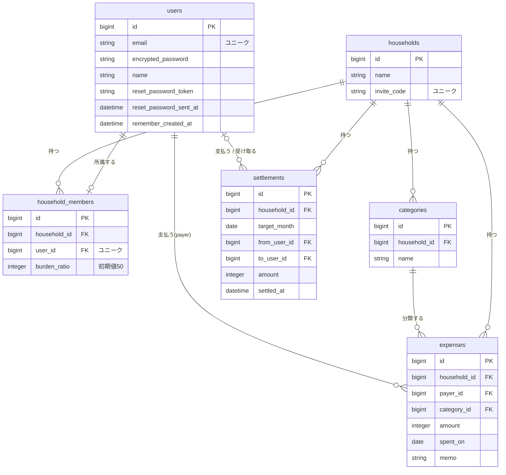

# 共同家計管理アプリ

2人で暮らす人のための、支出の記録と月末精算をかんたんにする家計管理アプリです。

## 概要

支出を登録するだけで月ごとの合計を自動で集計し、負担割合(初期値50-50)に応じて「誰が誰にいくら支払うか」を自動計算します。

## 開発の背景

現在は日々の支出をExcelに手入力して管理していますが、以下の課題があります。

- 毎回の入力に手間がかかる
- 月末に「どちらがいくら払ったか」を集計し、精算額を計算するのが大変

このアプリでは、支出の登録から月末の精算額の算出までを自動化し、これらの手間を解消します。

## 対象ユーザー

- 2人で暮らしていて、生活費を折半している人(カップル、夫婦、ルームシェアなど)

## 主な機能(MVP)

| 機能 | 内容 |
| --- | --- |
| ユーザー認証 | メールアドレスとパスワードでの新規登録・ログイン・パスワード再設定(Devise) |
| 世帯管理 | 世帯を作成し、表示される招待コードを相手が入力して参加 |
| 支出登録 | 金額・日付・カテゴリ・支払った人・メモを登録、編集、削除 |
| カテゴリ管理 | 初期カテゴリに加え、自由に追加・変更・削除 |
| 月別集計 | 月ごとの支出合計、支払った人ごとの合計を自動集計 |
| 精算 | 「誰が誰にいくら支払うか」を自動計算し、精算済みとして記録 |

## 仕様の詳細

### 世帯・メンバー

- 1つの世帯は2人まで。1人のユーザーが所属できる世帯は1つのみ
- 招待コードは世帯作成時に発行され、2人そろった時点で無効になる
- パートナーの参加前でも支出は登録できる(精算画面は2人そろってから表示)
- 世帯からの退出・アカウント削除はMVPでは対応しない

### 支出

- 世帯のメンバーであれば、相手が登録した支出も編集・削除できる
- 折半対象の支出のみを登録する(個人的な支出は扱わない)

### カテゴリ

- 世帯作成時に「家賃 / 食費 / 日用品 / 光熱費 / その他」を自動作成
- 初期カテゴリも含め、追加・名前の変更・削除ができる
- 支出が登録されているカテゴリは削除できない

### 精算

- 集計はカレンダー通りの月単位(1日〜月末)
- 精算は対象月が終わってから実行できる
- 精算済みの月は、支出の追加・編集・削除ができない
- 精算の記録はどちらのメンバーでも取り消せる。取り消すとその月の支出を再び編集できる

## 精算の計算方法

各メンバーが本来負担すべき額(月の合計 × 負担割合)と、実際に支払った額の差を求め、払いすぎた人に対して、少なかった人がその差額を支払います。**1円未満の端数は切り捨て**です。

負担割合が50-50の場合、1か月の支払合計がAさん `a` 円、Bさん `b` 円のとき、精算額は **(a − b) ÷ 2** 円になります。

> 例:Aさん 120,000円、Bさん 80,000円 → BさんがAさんに 20,000円 支払う

## 技術スタック

| 項目 | 内容 |
| --- | --- |
| 言語 | Ruby 3.4.10 |
| フレームワーク | Rails 8.1.3.1 |
| データベース | PostgreSQL 17 |
| 開発環境 | Docker / Docker Compose |
| 認証 | Devise |

## テーブル設計(MVP)



| テーブル | 役割 |
| --- | --- |
| users | ユーザー情報。Devise で管理する(`name` は独自に追加) |
| households | 世帯(2人で共有する家計の単位)。招待コードを持つ |
| household_members | 世帯とユーザーを結ぶ中間テーブル。負担割合を持つ |
| categories | 支出のカテゴリ。世帯ごとに管理する |
| expenses | 支出。`payer_id` は「誰が払ったか」を表し、users テーブルを参照する |
| settlements | 精算の記録。レコードがある月は精算済みとして扱う |

※ users テーブルのうち `name` 以外のカラムは、`bin/rails g devise User` で自動生成されます。

### 主なモデルの関連

```ruby
class User < ApplicationRecord
  devise :database_authenticatable, :registerable,
         :recoverable, :rememberable, :validatable

  has_one :household_member, dependent: :destroy
  has_one :household, through: :household_member
  has_many :paid_expenses, class_name: "Expense", foreign_key: :payer_id
end

class Expense < ApplicationRecord
  belongs_to :household
  belongs_to :payer, class_name: "User"
  belongs_to :category
end

class Settlement < ApplicationRecord
  belongs_to :household
  belongs_to :from_user, class_name: "User", optional: true
  belongs_to :to_user, class_name: "User", optional: true
end
```

`payer_id`・`from_user_id`・`to_user_id` はいずれも users テーブルを参照するため、`class_name: "User"` を指定しています。settlements の `from_user` / `to_user` は、精算額が0円の月も精算済みとして記録できるよう空を許可しています。

## MVP後の開発計画

### 1. レシート撮影による支出入力(OCR)

レシートを撮影すると、金額・日付・店名などを自動で読み取り、支出フォームに反映する機能です。

- **流れ**:撮影して送信 → 読み取り結果をフォームの初期値として表示 → ユーザーが確認・修正 → 保存
- OCRは必ず読み間違いが起きるため、**確認画面を必ず挟む**
- 撮影したレシート画像は Active Storage で保存し、後から見返せるようにする
- 技術の選択肢は、Google Cloud Vision などの専用OCRサービスか、画像を扱えるAIのAPIに項目の抽出を依頼する方法。日本語のレシートは後者のほうが精度・実装の手軽さで有利なことが多い
- 本番環境では画像の保存先を S3 などのクラウドストレージに切り替える設定が必要

### 2. 支出の小分類

現在の大分類(家賃・食費・日用品・光熱費・その他)の下に、小分類(野菜、魚など)を追加します。

- categories テーブルに `parent_id` を追加することで対応できる設計になっている

### 3. Googleログイン・LINEログイン

メールアドレスとパスワードに加え、外部サービスでのログインに対応します。

- Devise の `omniauthable` モジュールと、`omniauth-google-oauth2`・`omniauth-line` などの Gem で追加する

### 4. 負担割合の変更

収入に応じて6:4にするなど、50-50以外の割合を設定できるようにします。

- household_members の `burden_ratio` カラムと、割合に対応した精算ロジックは実装済み
- 変更画面と、2人の割合の合計が100になっているかのバリデーションを追加する

### 5. 世帯からの退出・アカウント削除

- 退出したメンバーが登録した支出や精算記録の扱いを決める必要があり、実装は複雑になる
- アカウント削除は Devise の `registerable` に標準で含まれるが、MVPでは画面に表示しない

### 着手する順番

**レシートOCRを最優先**とします。「入力の手間」という開発当初の課題に最も直接効く機能であり、このアプリならではの価値になるためです。

その後は、小分類 → 負担割合の変更 → 外部ログイン → 退出・アカウント削除、の順を想定します。小分類と負担割合はMVPの設計に拡張の余地を用意してあるため着手しやすく、退出・アカウント削除は影響範囲が広いので最後に回します。

---

## 環境構築

### 事前準備

以下がインストールされていることを確認してください。

- [Docker Desktop](https://www.docker.com/products/docker-desktop/)
- Git

```bash
docker -v
docker compose version
git -v
```

### 1. リポジトリをクローン

```bash
git clone <リポジトリのURL>
cd myapp
```

### 2. Dockerイメージをビルド

```bash
docker compose build
```

### 3. コンテナを起動

```bash
docker compose up -d
```

### 4. データベースを作成

```bash
docker compose exec web bin/rails db:prepare
```

### 5. 動作確認

ブラウザで以下にアクセスし、画面が表示されれば完了です。

http://localhost:3000

## よく使うコマンド

### コンテナ操作

```bash
# 起動
docker compose up -d

# 停止
docker compose down

# 再起動
docker compose restart web

# 起動状態の確認
docker compose ps

# ログの確認
docker compose logs -f web

# コンテナの中に入る
docker compose exec web bash
```

### Rails操作

```bash
# Railsコンソール
docker compose exec web bin/rails console

# マイグレーション実行
docker compose exec web bin/rails db:migrate

# マイグレーションを1つ戻す
docker compose exec web bin/rails db:rollback

# ルーティング確認
docker compose exec web bin/rails routes
```

### Gemの追加

`Gemfile` を編集した後、以下を実行します。

```bash
docker compose exec web bundle install
docker compose restart web
```

### Devise

```bash
# 導入(初回のみ)
docker compose exec web bundle add devise
docker compose exec web bin/rails g devise:install
docker compose exec web bin/rails g devise User
docker compose exec web bin/rails db:migrate

# ログイン・新規登録画面をカスタマイズする場合
docker compose exec web bin/rails g devise:views
```

- `bin/rails g devise User` で生成されたマイグレーションに、`db:migrate` の前に `t.string :name, null: false` を追加する
- `config/environments/development.rb` に `config.action_mailer.default_url_options = { host: "localhost", port: 3000 }` を設定する(パスワード再設定メールで使用)

## モデル・コントローラの生成

### モデル

モデル名は単数形・先頭大文字。生成後は必ずマイグレーションを実行する。

```bash
docker compose exec web bin/rails g model Post title:string body:text
docker compose exec web bin/rails db:migrate
```

主なカラムの型:`string` / `text` / `integer` / `boolean` / `date` / `datetime` / `references`

### コントローラ

コントローラ名は複数形・先頭大文字。

```bash
docker compose exec web bin/rails g controller Posts index show
```

### scaffold(モデル・コントローラ・画面を一括生成)

```bash
docker compose exec web bin/rails g scaffold Post title:string body:text
docker compose exec web bin/rails db:migrate
```

### 生成したファイルの削除

マイグレーション実行済みの場合は、先に `db:rollback` を行う。

```bash
docker compose exec web bin/rails db:rollback
docker compose exec web bin/rails d model Post
docker compose exec web bin/rails d controller Posts
```

## トラブルシューティング

### ポート3000が使用中と表示される

他のアプリが3000番ポートを使用しています。そのアプリを停止するか、`compose.yaml` の `ports` を `"3001:3000"` に変更し、http://localhost:3001 にアクセスしてください。

### 「A server is already running」と表示される

```bash
rm -f tmp/pids/server.pid
docker compose restart web
```

### データベースに接続できない

`db` コンテナが起動しているか確認してください。

```bash
docker compose ps
```

### 環境を完全にリセットしたい

⚠️ データベースのデータもすべて削除されます。

```bash
docker compose down -v
docker compose build --no-cache
docker compose up -d
docker compose exec web bin/rails db:prepare
```

## ファイル構成(Docker関連)

| ファイル | 役割 |
| --- | --- |
| `Dockerfile.dev` | 開発用のDockerイメージ定義 |
| `compose.yaml` | 開発用コンテナ(web / db)の構成 |
| `Dockerfile` | 本番用(Railsが自動生成) |