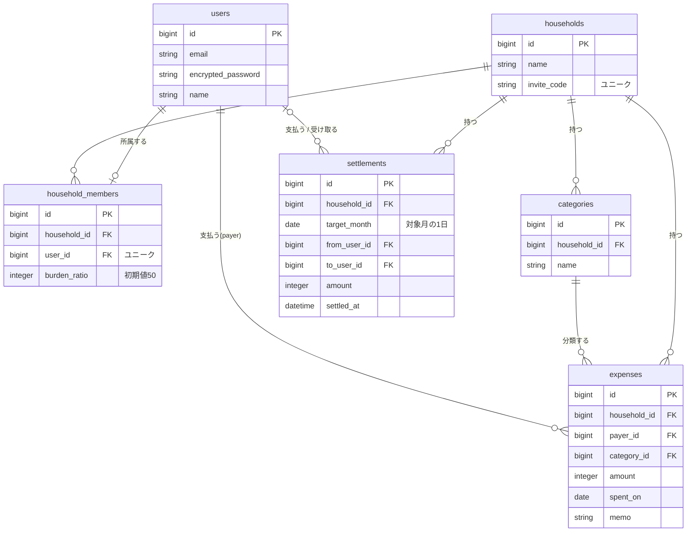

# 共同家計管理アプリ

2人で暮らす人のための、支出の記録と月末精算をかんたんにする家計管理アプリです。

## 概要

支出を登録するだけで月ごとの合計を自動で集計し、負担割合(初期値50-50)に応じて「誰が誰にいくら支払うか」を自動計算します。

## 開発の背景

現在は日々の支出をExcelに手入力して管理していますが、以下の課題があります。

- 毎回の入力に手間がかかる
- 月末に「どちらがいくら払ったか」を集計し、精算額を計算するのが大変

このアプリでは、支出の登録から月末の精算額の算出までを自動化し、これらの手間を解消します。

## 対象ユーザー

- 2人で暮らしていて、生活費を折半している人(カップル、夫婦、ルームシェアなど)

## 主な機能(MVP)

| 機能 | 内容 |
| --- | --- |
| ユーザー認証 | メールアドレスとパスワードでの新規登録・ログイン |
| 世帯管理 | 世帯を作成し、表示される招待コードを相手が入力して参加 |
| 支出登録 | 金額・日付・カテゴリ・支払った人・メモを登録、編集、削除 |
| カテゴリ管理 | 初期カテゴリに加え、自由に追加・変更・削除 |
| 月別集計 | 月ごとの支出合計、支払った人ごとの合計を自動集計 |
| 精算 | 「誰が誰にいくら支払うか」を自動計算し、精算済みとして記録 |

## 仕様の詳細

### 世帯・メンバー

- 1つの世帯は2人まで。1人のユーザーが所属できる世帯は1つのみ
- 招待コードは世帯作成時に発行され、2人そろった時点で無効になる
- パートナーの参加前でも支出は登録できる(精算画面は2人そろってから表示)
- 世帯からの退出・アカウント削除はMVPでは対応しない

### 支出

- 世帯のメンバーであれば、相手が登録した支出も編集・削除できる
- 折半対象の支出のみを登録する(個人的な支出は扱わない)

### カテゴリ

- 世帯作成時に「家賃 / 食費 / 日用品 / 光熱費 / その他」を自動作成
- 初期カテゴリも含め、追加・名前の変更・削除ができる
- 支出が登録されているカテゴリは削除できない

### 精算

- 集計はカレンダー通りの月単位(1日〜月末)
- 精算は対象月が終わってから実行できる
- 精算済みの月は、支出の追加・編集・削除ができない
- 精算の記録はどちらのメンバーでも取り消せる。取り消すとその月の支出を再び編集できる

## 精算の計算方法

各メンバーが本来負担すべき額(月の合計 × 負担割合)と、実際に支払った額の差を求め、払いすぎた人に対して、少なかった人がその差額を支払います。**1円未満の端数は切り捨て**です。

負担割合が50-50の場合、1か月の支払合計がAさん `a` 円、Bさん `b` 円のとき、精算額は **(a − b) ÷ 2** 円になります。

> 例:Aさん 120,000円、Bさん 80,000円 → BさんがAさんに 20,000円 支払う

## 今後の追加予定

- 支出の小分類(野菜、魚など)
- Googleログイン、LINEログイン
- 負担割合の変更(収入に応じて6:4にするなど)
- 世帯からの退出・アカウント削除

## 技術スタック

| 項目 | 内容 |
| --- | --- |
| 言語 | Ruby 3.4.10 |
| フレームワーク | Rails 8.1.3.1 |
| データベース | PostgreSQL 17 |
| 開発環境 | Docker / Docker Compose |
| 認証 | Devise |

## テーブル設計(MVP)



| テーブル | 役割 |
| --- | --- |
| users | ユーザー情報 |
| households | 世帯(2人で共有する家計の単位)。招待コードを持つ |
| household_members | 世帯とユーザーを結ぶ中間テーブル。負担割合を持つ |
| categories | 支出のカテゴリ。世帯ごとに管理する |
| expenses | 支出。`payer_id` は「誰が払ったか」を表し、users テーブルを参照する |
| settlements | 精算の記録。レコードがある月は精算済みとして扱う。`household_id` と `target_month` の組み合わせはユニーク |

※ 認証には Devise を使用します。ログイン状態は Cookie で管理するため、sessions テーブルは作成しません。

### 主なモデルの関連

```ruby
class Expense < ApplicationRecord
  belongs_to :household
  belongs_to :payer, class_name: "User"
  belongs_to :category
end

class Settlement < ApplicationRecord
  belongs_to :household
  belongs_to :from_user, class_name: "User", optional: true
  belongs_to :to_user, class_name: "User", optional: true
end
```

`payer_id`・`from_user_id`・`to_user_id` はいずれも users テーブルを参照するため、`class_name: "User"` を指定しています。settlements の `from_user` / `to_user` は、精算額が0円の月も精算済みとして記録できるよう空を許可しています。